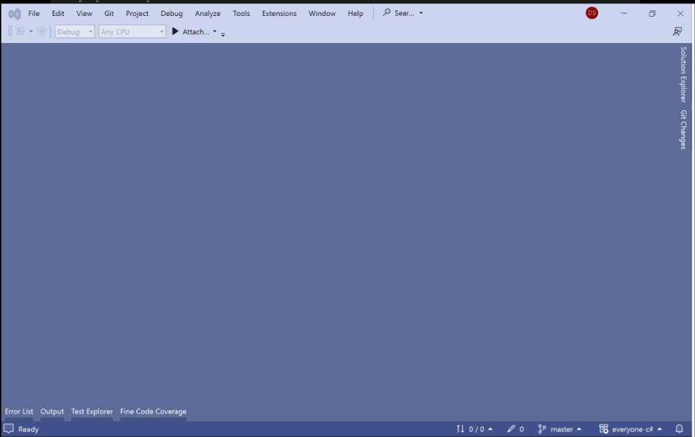
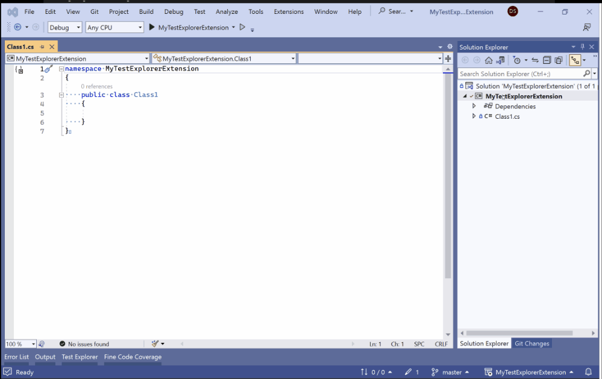

# Extending Visual Studio: Test Explorer (Work in progress)

## Documentation? What Documentation?

If you wanted to integrate your test framework into [Visual Studio's Test Explorer](https://learn.microsoft.com/en-us/visualstudio/test/run-unit-tests-with-test-explorer), what would you search for on the internet? How about "how to extend Visual Studio Test Explorer"? Or maybe even "visual studio test explorer extensibility"? The results of both of those queries are more than happy to teach you how to use Test Explorer, but nothing about how to extend it to use your stuff. You may get lucky and find the [vstest](https://github.com/microsoft/vstest) GitHub repository, but the documents in there are mostly proposals/RFCs and explanations of architecture. There's a little bit of help when it starts talking about [ITestDiscoverer](https://github.com/microsoft/vstest/blob/main/src/Microsoft.TestPlatform.ObjectModel/Adapter/Interfaces/ITestDiscoverer.cs) and [ITestExecutor](https://github.com/microsoft/vstest/blob/main/src/Microsoft.TestPlatform.ObjectModel/Adapter/Interfaces/ITestExecutor.cs), but I still had plenty of searching around to do before I was able to get my tests running in Test Explorer. Let's get down to the real purpose of this article now. What is the simplest way to get your tests running in Visual Studio's Test Explorer?

## Preparation

Just in case you don't already have it installed, you'll need Visual Studio to follow these instructions. You can pick up the Community (aka Free) edition [here](https://visualstudio.microsoft.com/vs/community/). When you have to pick workloads to install, you'll only need the .NET Desktop Development workload.

## Project Setup

Now that you have Visual Studio setup with the correct workload, let's create our Test framework. Start by creating a new C# Class Library project:

1. From the top-level menu, click on File -> New Project.
2. Select "C# Class Library" as the type of the project.
3. Give it any project name you want.
4. The default .NET target (7.0 in this case) is fine.

Once the project is created, we now to need to install the [Microsoft.TestPlatform.ObjectModel](https://www.nuget.org/packages/Microsoft.TestPlatform.ObjectModel) NuGet package to get access to the types that will allow us to integrate with Test Explorer.

1. Right-click on the project node in the "Solution Explorer".
2. Click "Manage NuGet Packages".
3. Click on the "Browse" text/tab in the page that opens up.
4. Enter "Microsoft.TestPlatform.ObjectModel" into the search box.
5. Choose the option that has a blue check mark next to it.
6. Click on the "Install" button to the right (the latest stable version will be just fine).